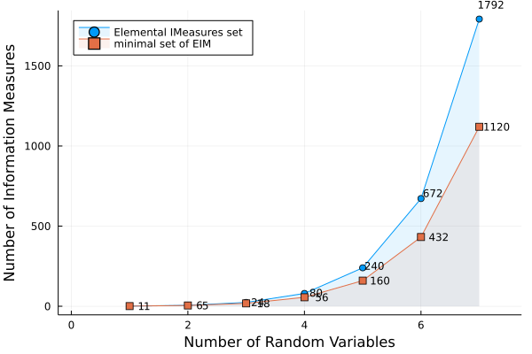

# Information Measures in Canonical form

```@contents
Pages = ["decomposition.md"]
```

# Information Measures
TBD
## Entropy
TBD
## Mutual Information

## Basic Information Measures
TBD

* Conditional Entropy of the form ``H\left(\mathbf{X}_a|\mathbf{X}_{b}\right)``
* Conditional Mutual Information of the form ``I\left(\mathbf{X}_a;\mathbf{X}_{b\ne i}|\mathbf{X}_c\right)``

where ``a,b,c \subseteq \mathcal{N}_{n}`` and ``a,b \ne \emptyset``.

## Elemental Information Measures

* Conditional Entropy of the form ``H\left(X_i|X_{j\ne i}\right)``
* Conditional Mutual Information of the form ``I\left(X_i;X_{j\ne i}|\mathbf{X}_\kappa \subseteq \mathcal{N}_{n}\backslash\{i,j\}\right)``


## Properties of IM
Positivity (TBD)


# Information Inequalities
``f() \ge 0`` where ``f`` is a linear IE (TBD)
TBD
## Unconstrained Inequalities
## Constrained IE

## Information Constraints
TBD
* Markov Chain
* Independence of random variables
* Conditional Independence
* Functional Dependency (Related random variables) ``Y=fun(X)`` 
A random variable ``Y`` is a mapping from another random variable ``X`` (TBD)
* TBD

 Constraints can be expressed linear algebraically ``Q\mathfak{h} = 0`` where ``Q`` is the constraint matrix.

# Elemental Information Inequalities 
Information Inequalities which belong to any of the following type:
* Conditional Entropy of the form ``H\left(X_i|X_{j\ne i}\right)``
* Conditional Mutual Information of the form ``I\left(X_i;X_{j\ne i}|\mathbf{X}_\kappa \subseteq \mathcal{N}_{n}\backslash\{i,j\}\right)``

are called Elemental Information Inequalities (EIM). These are entropies of a single random variable or and conditional entropies of a single random variable, conditioned on other random variable or sets of random variables.
"


# Canonical Represenation

Canonical representation refers to expressing information expression as linear combination of entropies and joint entropies. e.g., ``H(X1,X2,...,X_n)``. For every Information Expression one find a unique canonical representation.

Elemental expressions can be decomposed to canonical form as follows:
* ``H\left(X_i|\textbf{X}_{\mathcal{N} \backslash \{i\}}\right) = H\left(\textbf{X}_{\mathcal{N}}\right)``
* ``I\left(X_i;X_j|\textbf{X}_{\kappa}\right)= H\left(X_i,\textbf{X}_\kappa\right)+H\left(X_j,\textbf{X}_\kappa\right)-H\left(X_i,X_j,\textbf{X}_\kappa\right)-H\left(\textbf{X}_\kappa\right)``

# Geometry of ``\Gamma_{n}^{*}``

The region ``\Gamma_{n}^{*}`` is defined as

``\Gamma_{n}^{*} = \bigcup_{p \in \mathcal{P}} \mathfrak{h}(p)``

where ``\mathcal{P}`` is the space of all all probability distributions indued on the random variable space  (TBD. Have to define ``X_1,\ldots X_n`` and its probability space ``\mathcal{X}_1 \ldots \mathcal{X}_{n}`` etc.)

## Geometry of ``\Gamma_{n}``
``\Gamma_{n}`` is the space encapsulating all entropic points. 

``\Gamma_{n} \equiv \left\{\mathbf{h} \in \mathbb{R}^{2^{n}-1} | \mathbf{h} \in \mathbb{B} \right\}``

## Examples: Entropic space for ``\Gamma_{2}``

This is easy to visualize. The built in function `volumeΓ()` can be used to generate and then plot the visualization using `plotΓ(n)`.

```@example visualGamma2a
using InformationInequalities
plotΓ(n=2,points=yes,max=3,color=:gold)
```


## Basic concepts

## Entropic space for ``\Gamma_{2}``


Consider the linear system

```math
\mathbf{Ax}=\mathbf{b},
```

*TBD* the interval linear system by a *real* matrix ``C`` means to multiply both sides of the equation by ``C``, obtaining the new system

```math
C\mathbf{Ax}=C\mathbf{b},
```

which is called *TBD system*. Let us denote by ``A_c`` the *midpoint matrix* of ``\mathbf{A}``. Popular choices for ``C`` are

- Inverse midpoint TBD: ``C\approx A_c^{-1}``
- Inverse diagonal TBD: ``C\approx D_{A_c}^{-1}`` where ``D_{A_c}`` is the diagonal matrix containing the main diagonal of ``A_c``.


# Shannon Type Inequalities
TBD
An Information inequality of the form ``f=\mathbf{b}^{\top} \mathfrak{h} \ge 0``, we just need to check
``\min_{\mathfrak{h}:G\mathfrak{h} \ge 0} \mathbf{b}^{\top} \mathfrak{h} = 0``
These are effectively encapsulated to the following optimization problem. This can now be solved using Linear Programming techniques (TBD)

The constrained Information Inequality ``f=\mathbf{b}^{\top} \mathfrak{h} \ge 0`` with constraint ``Q \mathfrak{h} =0`` can be similarly treated under the optimization framework as,

``\underset{\min_{\mathfrak{h}:G\mathfrak{h} \ge 0}}{Q\mathfrak{h}=0} \mathbf{b}^{\top} \mathfrak{h} = 0``


# Non Shannon Type Inequalities

# Linear Programming and Duality principles
## Strong duality 
# Generating proofs for Shannon Type Inequalities
Lagrange formulation
TBD

## Example of a proof generation
**Note**: The showProof has a rendering display problem on GR/HTML and hence git complaints. Fixme!
```@example proofShannon2
using InformationInequalities
#A="-3I(X;Y|Z)+2H(X) \ge 0"
showProof("-3I(X;Y|Z)+2H(X)",Markov(X,Z,Y))
```


### Improve numerical stability

Even if the algorithms theoretically work

TBD: The search space is still double exponential without exploiting any sparsity structure which seems to exisit (TBD).
