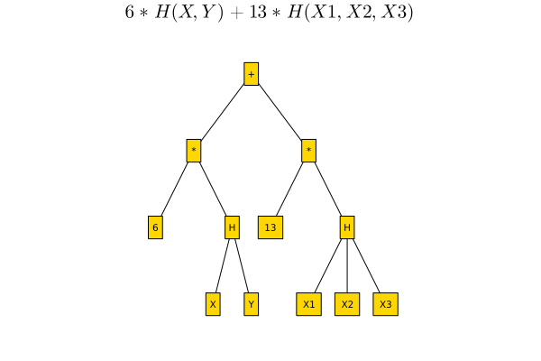

[](https://github.com/lucaferranti/IntervalLinearAlgebra.jl/blob/main/LICENSE)[](https://github.com/nivupai/InformationInequalities.jl/actions)[](https://codecov.io/gh/nivupai/InformationInequalities.jl)[](#Citation)[](https://doi.org/10.5282/zenodo.5363564)

## Overview

This package contains routines to perform numerical linear algebra using interval arithmetic. This can be used both for rigorous computations and uncertainty propagation.

An first overview of the package was given at BLA, the slides are available [here](https://github.com/nivupai/BLA).

```@raw html
<iframe style="width:560px; height:315px" src="https://www.youtube.com/embed/QHEV9Ie6spo" title="YouTube video player" frameborder="0" allow="accelerometer; autoplay; clipboard-write; encrypted-media; gyroscope; picture-in-picture" allowfullscreen></iframe>
```

## Features

!!! note 
    The package is still under active development and things evolve quickly (or at least should)

- enclosure of the solution of interval linear systems
- exact characterization of the solution set of interval linear systems using 
- verified solution of floating point linear systems
- enclosure of eigenvalues of interval matrices
- verified computation of eigenvalues and eigenvectors of floating point matrices

## Installation

Open a Julia session and enter

```julia
using Pkg; Pkg.add("InformationInequalities")
```

this will download the package and all the necessary dependencies for you. Next you can import the package with

```julia
using InformationInequalities
```

and you are ready to go.

## Quickstart

```julia
using LinearAlgebra, LazySets, Plots

A = [2..4 -1..1; -1..1 2..4]
b = [-2..2, -1..1]

Xenclose = solve(A, b)
polytopes = solve(A, b, LinearOettliPrager())

plot(UnionSetArray(polytopes), ratio=1, label="solution set", legend=:top)
plot!(IntervalBox(Xenclose), label="enclosure")
```



## Citation

If you use this package in your work, please cite it as
```
@software{nrethnakar2022,
author = {
            Nivedita Rethnakar and
            Raymond W Yeung
            Suhas Diggavi
         },
title  = {InformationInequalities.jl: Exploring Information Theoretic Inequalities},
month  = {1},
year   = {2022},
doi    = {10.5282/zenodo.5363564},
url    = {https://github.com/juliaintervals/InformationInequalities.jl}
}
```


```@meta
CurrentModule = InformationInequalities
```

# InformationInequalities

Documentation for [InformationInequalities](https://github.com/nivupai/InformationInequalities.jl).

```@index
```

```@autodocs
Modules = [InformationInequalities]
```
