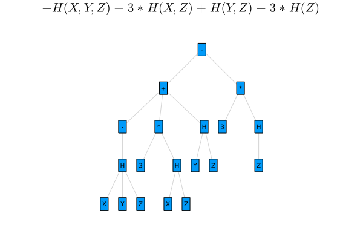

[](https://github.com/lucaferranti/IntervalLinearAlgebra.jl/blob/main/LICENSE)[](https://github.com/nivupai/InformationInequalities.jl/actions)[](https://codecov.io/gh/nivupai/InformationInequalities.jl)[](#Citation)[](https://doi.org/10.5282/zenodo.5363564)

## Overview

This package contains routines to perform Information Theoretic measures. The priliminary build up of this tool is to validate, prove and analyze Information Inequalities. This can be used both for rigorous computations and analysis of Information measures and expressions. 

An first overview of the package was given at BLA, the slides are available [here](https://github.com/nivupai/BLA).

```@raw html
<iframe style="width:560px; height:315px" src="https://www.youtube.com/embed/QHEV9Ie6spo" title="YouTube video player" frameborder="0" allow="accelerometer; autoplay; clipboard-write; encrypted-media; gyroscope; picture-in-picture" allowfullscreen></iframe>
```

## Features

!!! note 
    The package is still under active development and things evolve quickly (or at least should)

- enclosure of the solution of interval linear systems
- exact characterization of the entropic space
- verified proof and ``\LaTeX`` rendering in display
- enclosure of singularvalues of the entropic space generator matrix
- Further work

## Installation

Open a Julia session and enter

```julia
using Pkg; Pkg.add("InformationInequalities")
```

this will download the package and all the necessary dependencies for you. Next you can import the package with

```julia
using InformationInequalities
```

and you are ready to go.

## Quickstart

```julia
using InformationInequalities
using Plots
E="3I(X;Y|Z)+2H(X|Y,Z)"
A=LinearInformationExpressionToCanonical(UE)
```
``-H(X,Y,Z) + 3 H(X,Z) + H(Y,Z) - 3 H(Z)``.

To plot an Information expression as a tree graph in Entropy co-ordinates,
```julia
using InformationInequalities
using Plots
E="3I(X;Y|Z)+2H(X|Y,Z)"
A=plotIE(E)
```


Another example


## Citation

If you use this package in your work, please cite it as
```
@software{nrethnakar2022,
author = {
            Nivedita Rethnakar and
            Raymond W Yeung
            Suhas Diggavi
         },
title  = {InformationInequalities.jl: Exploring Information Theoretic Inequalities},
month  = {1},
year   = {2022},
doi    = {10.5282/zenodo.5363564},
url    = {https://github.com/juliaintervals/InformationInequalities.jl}
}
```


```@meta
CurrentModule = InformationInequalities
```

# InformationInequalities

Documentation for [InformationInequalities](https://github.com/nivupai/InformationInequalities.jl).

```@index
```

```@autodocs
Modules = [InformationInequalities]
```
