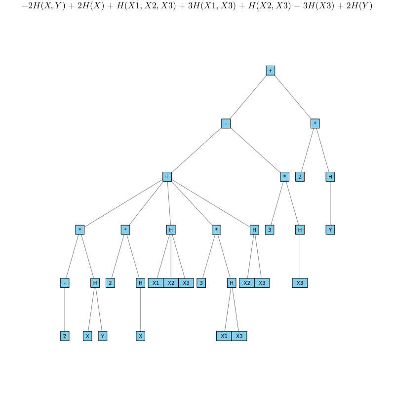

# Eigenvalue computations


For the Information Expression ``2H(X1,X2|X3)+I(X1;X2|X3)+2H(X1,X3)+2I(X;Y)``, the canonical representation is ``-2H(X,Y)+2H(X)+H(X1,X2,X3)+3H(X1,X3)+H(X2,X3)-3H(X3)+2H(Y)``.


```@example entropicHex1
using InformationInequalities
SE="2H(X1,X2|X3)+I(X1;X2|X3)+2H(X1,X3)+2I(X;Y)"
A5=LinearInformationExpressionToCanonical(SE)
#plotEntropyTree(A5,curves=false,nodecolor=:skyblue,edgecolor=:gray,nodesize=0.13,nodeshape=:rect,titlefontsize=10,title=latexstring(replace((A5),"*"=>""," "=>"")))
#savefig("gPlotHex1.svg") # hide
```


With simplification `simplifyH(A5)` we get



Using the functions `PlotIE` or `PlotInformationExpression`, it is easy to visualize the tree graph of the canonical decomposition.

```@example simpletreeEx1
using InformationInequalities
using LaTeXStrings;
E="2I(X;Y|Z)+3H(Z)"
#plotIE(E,nodecolor=:forestgreen)
plotIE(E,nodecolor=:forestgreen,curves=false,edgecolor=:lightgray,nodeshape=:rect,title=latexstring(LinearInformationExpressionToCanonical(E))); # Hide
savefig("gplotEx0");
```


## Another topic TBD
For now duplicate and see if it works (FixMe)

Given a (real or complex) interval matrix ``A\in\mathbb{IC}^{n\times n}``, we define the eigenvalue set 

```math
\mathbf{\Lambda}=\{\lambda\in\mathbb{C}: \lambda\text{ is an eigenvalue of }A\text{ for some }A\in\mathbf{A}\}.
```

While characterizing the solution set ``\mathbf{\Lambda}`` (or even its hull) is computationally challenging, the package offers the function TBD which contains an interval box containing ``\mathbf{\Lambda}``. 

!!! note
    At the moment, `eigenbox` is not rigorous, that is the computations for the non-interval eigenvalue problem solved internally are carried out using normal non-verified floating point computations.

To demonstrate the functionality, let us consider the following interval matrix

```@example eigs
using InformationInequalities

A = [3 2 1
     2 2 2
     0 1 2]
```


To get a qualitative evaluation of the enclosure, we can simulate the solution set of ``\mathbf{A}`` using Montecarlo, as it is done in the following example

```@example eigs
using Random; # hide
using LinearAlgebra;
Random.seed!(42) # hide
using Plots
N = 1000

evalues = zeros(ComplexF64, 4, N)

for i in 1:N
    evalues[:, i] = eigvals(rand(4,4))
end

rpart = real.(evalues)
ipart = imag.(evalues)

plot(; ratio=1, label="enclosure")
scatter!(rpart[1, :], ipart[1, :]; label="λ₁")
scatter!(rpart[2, :], ipart[2, :]; label="λ₂")
scatter!(rpart[3, :], ipart[3, :]; label="λ₃")
scatter!(rpart[4, :], ipart[4, :]; label="λ₄")
xlabel!("real")
ylabel!("imag")
savefig("eigs.png") # hide
```


Internally, the generical interval eigenvalue problem is